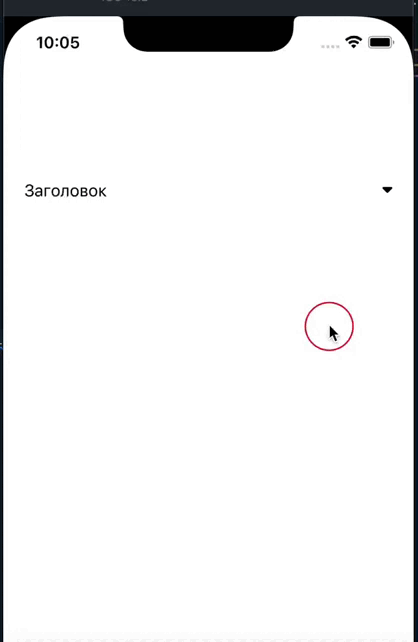

# Accordion

| IOS | Android |
| --- | ------- |
|  |  |

### Пример Вызова

```jsx

<Accordion
  // Заголовок
  title={'Заголовок'} // => String (required)

  // Описание
  text={'Hello World'} // => String (required)

  // По умолчанию false, раскрывает сразу Accordion если передать true
  isOpen={false} // =>  Boolean (optional)

  // Объект стилей для контейнера спойлера
  style={{}} // => Object (optional)
/>
