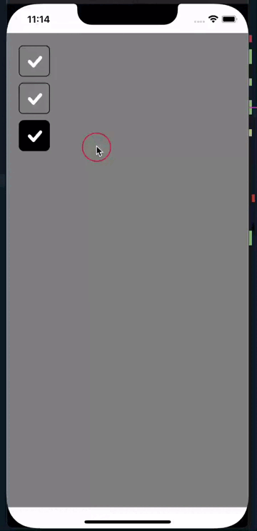
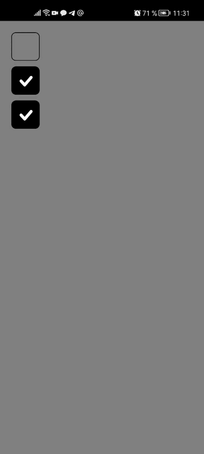

# CheckBox

| IOS | Android |
| --- | ------- |
|  |  |

### Пример Вызова

```jsx

<CheckBox
  // Заголовок чекбокса
  title={'Заголовок'} // => String (optional)

  // Состояние чекбокса
  checked={false} // => Boolean (optional)

  // Чекбокс не активен и на него нельзя кликнуть
  disabled={false} // => Boolean (optional)

  // Svg иконка
  svhIcon={svg} // => Jsx (optional)

  // Функция которая отработает при состоянии checked
  onPressChecked={function} // => Function (optional)

  // Функция которая отработает при состоянии not checked
  onPressNotChecked={function} // => Function (optional)

  // Объект стилей для заголовка
  titleStyle={objStyle} // => Object (optional)

  // Объект стилей при состоянии checked
  activeCheckedStyle={objStyle} // => Object (optional)

  // Объект стилей при состоянии checked
  activeCheckedStyle={objStyle } // => Object (optional)

  // Объект стилей для чекбокса
  checkboxInnerStyle={objStyle} // => Object (optional)
/>
