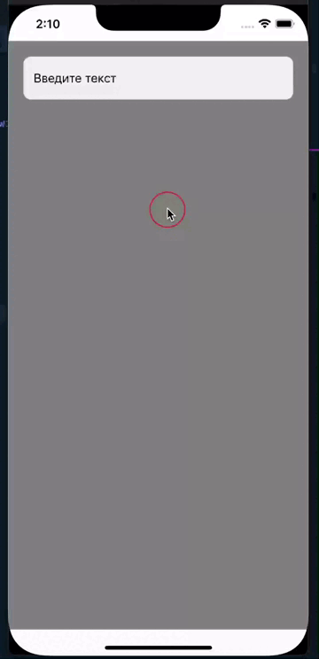
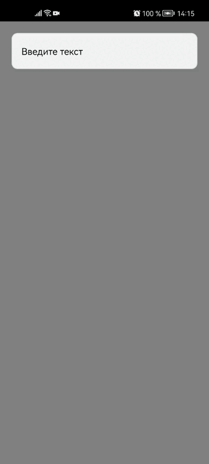

# InputText

| IOS | Android |
| --- | ------- |
|  |  |

## Пример Вызова

В компонент в качестве доп. параметров можно передавать все стандартные параметры которые поддерживает **TextInput** в react-native
```jsx

<InputText
  // Текст который будет по умолчания при запуске приложения
  value={'Hello World'} // => String (optional)

  // Если false текст недоступен для редактирования. Значение по умолчанию равно true.
  editable={true} // => Boolean (optional)

  // Строка, которая будет отображаться перед вводом текста
  placeholder={'Введите текст'} // => String (optional)

  // Цвет placeholder текста
  placeholderTextColor={'#000'} // => String (optional)

  // Функция которая будет вызываться при вводе текста
  onChange={function} // => Function (optional)

  // Функция которая будет вызываться при фокусе поля ввода
  onFocus={function} // => Function (optional)

  // Функция которая будет вызываться при потере фокуса с поля ввода
  onBlur={function} // => Function (optional)

  // Текст ошибки
  error={'Ошибка'} // => String (optional)

  // Объект стилей для текста ошибки
  errorStyle={objStyle} // => Object (optional)

  // Текст для доп. информации
  prompt={'Доп информация'} // => String (optional)

  // Объект стилей для доп. информации
  promptStyle={objStyle} // => Object (optional)

  // Svg иконка
  RightIcon={SVG} // => Jsx (optional)

  // Объект стилей для svg иконки
  styleRightIcon={objStyle} // => Object (optional)

  // Объект стилей блока обертки
  inputWrapperStyle={objStyle} // => Object (optional)
  
  // Объект стилей поля ввода
  inputStyle={objStyle} // => Object (optional)
/>
