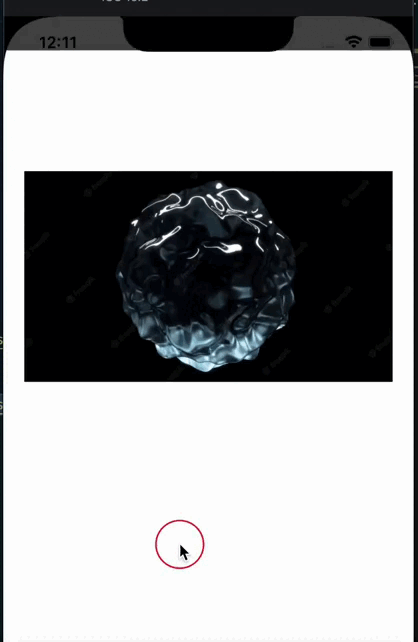

# ProgressiveImage

| IOS | Android |
| --- | ------- |
|  |  |

## Пример Вызова

В компонент в качестве доп. параметров можно передавать все стандартные параметры которые поддерживает **TextInput** в react-native
```jsx
<ProgressiveImage
  // Ссылка на картинку в плохом качестве
  thumbnailSource={{uri: 'path'}} // => String (required)

  // Ссылка на картинку в хорошем качестве
  source={{uri: 'path'}} // => String (required)
/>
