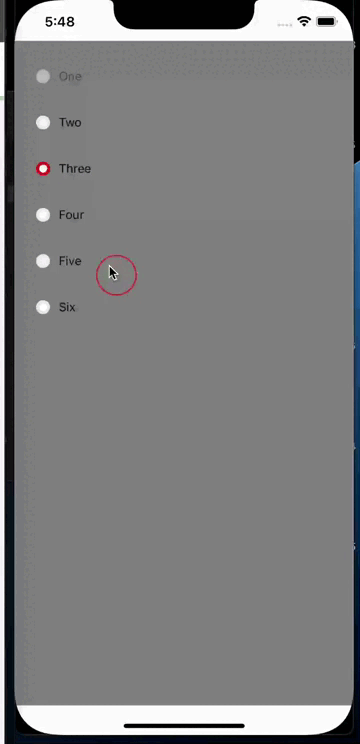
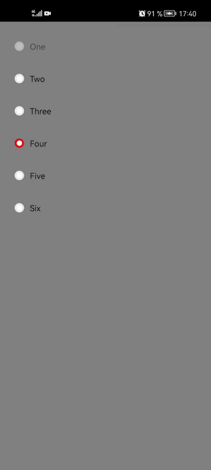

# RadioGroup

| IOS | Android |
| --- | ------- |
|  |  |


## Пример Вызов

```jsx

<RadioGroup
  // Массив данных 
  data={[el, el, el]} // => required (array)
  //el это объект куда нужно записывать следующие параметры
  // el = {
  //		id: number, 		-> id элемента (required)
  //		disabled: bool, 	-> элемент который будет не активен (optional)
  //		title: string, 		-> заголовок элемента (optional)
  //		description: string	-> описание элемента (optional)
  // }
  
  // Элемент который будет активен при запуске приложения
  currentOption={2} // => optional (number)

  // Метод который отработает при клике на чекбокс
  onSelectOption={() => {}} // => optional (function)

  // Цвет обводки у радио кнопки
  radioColor={'#EAEAEA'} // => optional (string)

  // Цвет обводки у радио кнопки в состоянии active
  radioActiveColor={'#DE1212'} // => optional (string)

  // Объект стилей для контейнера где находятся радио кнопки
  containerStyle={objStyle} // => optional (obj)

  // Объект стилей для контейнера радио кнопки
  radioContainerStyle={objStyle} // => optional (obj)

  // Объект стилей для svg иконки у радио кнопки
  radioStyle={objStyle} // => optional (obj)

  // Объект стилей для обертки текста
  textContainerStyle={objStyle} // => optional (obj)

  // Объект стилей для заголовка
  titleStyle={objStyle} // => optional (obj)

  // Объект стилей для описания
  descriptionStyle={objStyle} // => optional (obj)
/>
