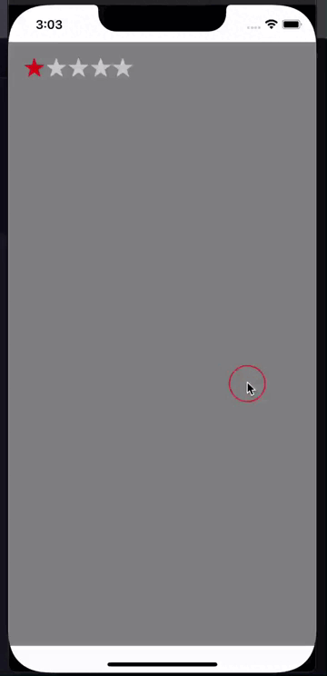

# Rating

| IOS | Android |
| --- | ------- |
|  |  |


## Пример Вызов

```jsx

<Rating
  // Количество звезд, п умолчанию 5
  starsCount={5} // => Number (optional)

  // Количество заполненных звезд при запуске
  rating={1} // => Number (optional)

  // Можно ли кликнуть по звезде, по умолчанию false можно 
	readonly={false} // => Bool (optional)

  // Функция которая выполнится при клике на звезду
  onRatingChange={() => {}} // => function (optional)

  // Объект в котором описываются ширина и высота звезды
  starSize={{ // => Object (optional)
    width: '26'
    height: '24'
  }}

  // Цвет звёзд
  color={'#C9C9C9'} // => String (optional)

  // Цвет активных(выбранных) звёзд
  fillColor={'#DE1212'} // => String (optional)

  // Объект стилей для контейнера
  styleContainer={objStyle} // => Object (optional)
/>
