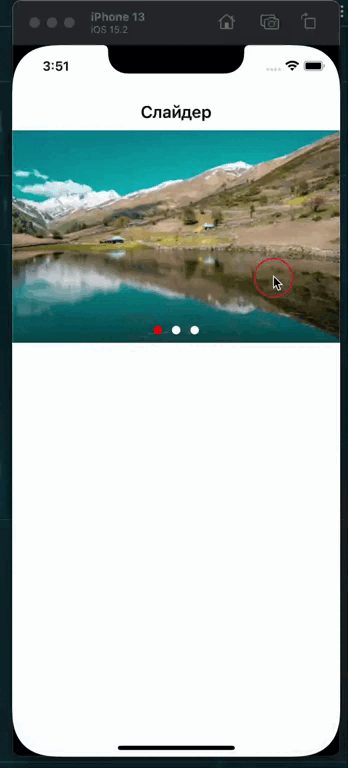

# Accordion

<div style="display: flex; column-gap: 30px">
	<p>IOS</p>
	
	<p>Android</p>
	
</div>

###  Вызов

```jsx
<Slider
	//массив ссылок изображений
	slides={['path', 'path']} // => required

	// активный слайд во время запуска
	currentSlide={1} // => optional

	// функция которая отработает при клике на слайд
	onSlidePress={ // => optional
		() => Alert.alert('Отработала функция при клике на слайд')
	}

	// объект стилей для контейнера
	containerStyle={objStyle} // => optional

	// объект стилей contentContainerStyle для ScrollView
	sliderStyle={objStyle} // => optional

	// объект стилей для контейнера dots-ов
	dotsContainerStyle={objStyle} // => optional
	
	// объект стилей для dots-ов
	dotsStyle={objStyle} // => optional

	// объект стилей для активного dots-а
	currentDotsStyle={objStyle} // => optional
/>
```
