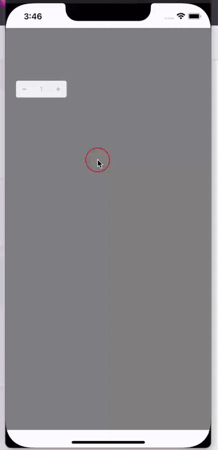

# Stepper

| IOS | Android |
| --- | ------- |
|  |  |


## Пример Вызов

```jsx

<Stepper
  // Функция которая будет срабатывать при увеличении числа
  onIncrement={() => {}} // Function (required)

  // Функция которая будет срабатывать при уменьшении числа
  onDecrement={() => {}} // Function (required)

  // Число которое будет при запуске, по умолчанию 1, нельзя поставь меньше 1
  stepper={1} // => Number (optional)

  // Объект стилей для контейнера
  containerStyle={objStyle} // => Object (optional)
  
  // Объект стилей для кнопки минуса
  btnMinusStyle={objStyle} // => Object (optional)
  
  // Объект стилей для кнопки плюса
  btnPlusStyle={objStyle} // => Object (optional)
/>
