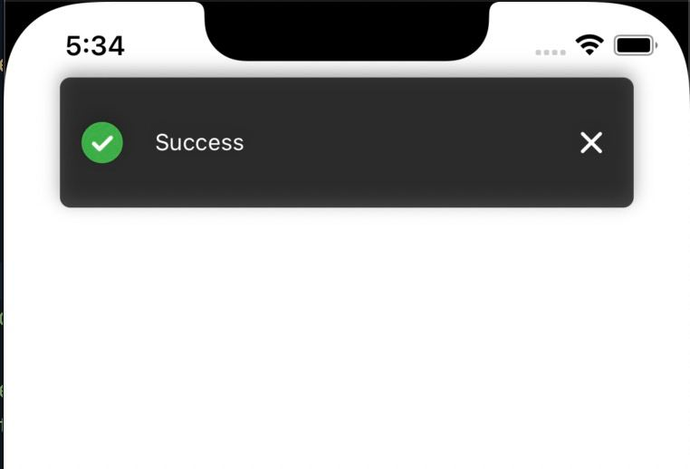
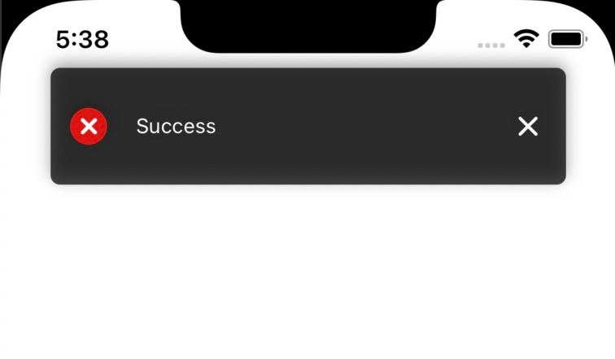
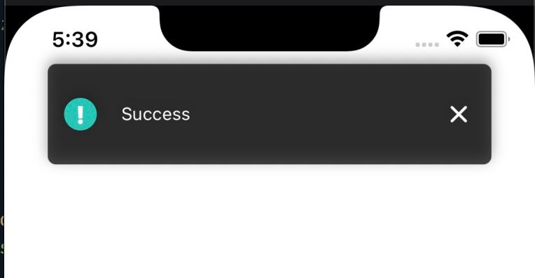

# Toast

| success | error | default |
| ------- | ------- | ------- |
|  |  |  |

### Пример Вызова

```jsx
const toastRef = useRef(null);

// showToast можно передать 3 параметра: 
// 1) message -> текст сообщения по умолчанию выводится 'Success' (string)
// 2) type    -> тип сообщения принимает три вида значений: success, error и info. По умолчанию выводится success (string)
// 3) delay   -> время в сек. через которое Toast исчезнет (number)

toastRef.current.showToast('Строка с текстом', 'success'); // Условие выполнено

toastRef.current.showToast('Строка с текстом', 'info'); // Предупреждение

toastRef.current.showToast('Строка с текстом', 'error'); // Ошибка

<Toast
  // Toast компонент использует forwardRef поэтому необходимо передать ref в его параметрах, благодаря этому можно вызвать метод showToast() вне компонента. showToast описан выше
  ref={ref} // => (required)

  // Скорость анимации появления Toast
  animDuration={300} // => Number (optional)

  // Скрыть иконку при необходимости
  hideIcon={false} // => Bool (optional)

  // Время в сек. через которое Toast исчезнет
  hideDelay={2000} // => Number (optional)
/>
```